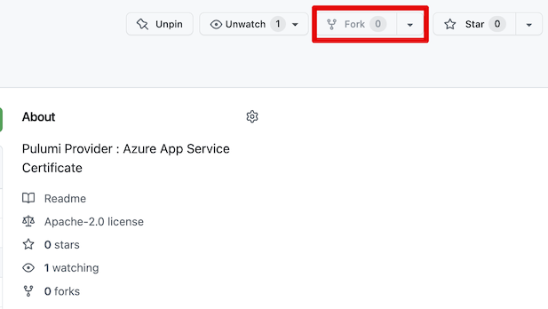
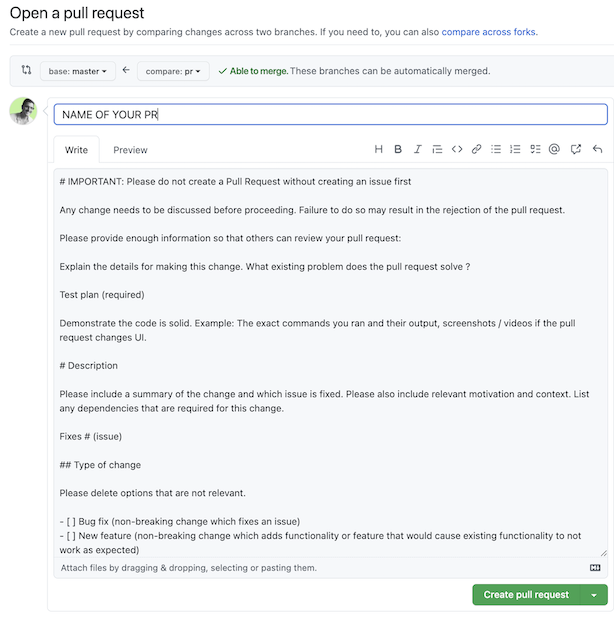

# How to contribute to Azure-certificate Open source (Contributer)

This guide aims to help you contributing to Azure Certificate. If you have found any problems, improvements that can be done, or you have a burning desire to develop new features for Azure Certificate, please make sure to follow the steps bellow.

- [How to open an issue](#how-to-open-an-issue)
- [Create your contribution to submit a pull request](#create-your-contribution-to-submit-a-pull-request)
  - [Fork to code in your personal repo](#fork-to-code-in-your-personal-repo)
  - [Clone your forked repository](#clone-your-forked-repository)
  - [Make sure that your repository is up to date](#make-sure-that-your-repository-is-up-to-date)
  - [Start your contribution code](#start-your-contribution-code)
  - [Commit your changes](#commit-your-changes)
  - [Create a pull request](#create-a-pull-request)
  - [Finally submit your pull request](#finally-submit-your-pull-request)

## Installation

After clone this repo

Use right node version

```bash
nvm use
```

If you don't have right node version or, nvm, look [this doc for mac](https://tecadmin.net/install-nvm-macos-with-homebrew/)

Install package

```bash
npm install
```

# How to open an issue

**Screenshots are coming soon**

An issue will open a discussion to evaluate if the problem / feature that you submit is eligible, and legitimate for Azure Certificate.

Check on the project tab if your issue / feature is not already created. In this tab, you will find the roadmap of Azure Certificate.

A Pull Request must be linked to an issue.
Before you open an issue, please check the current opened issues to insure there are no duplicate. Define if it's a feature or a bugfix.

Next, the Package team, or the community, will give you a feedback on whether your issue must be implemented in Azure Certificate, or if it can be resolved easily without a pull request.

# Create your contribution to submit a pull request

## Fork to code in your personal repo

The first step is to get our repository on your personal GitHub repositories. To do so, use the "Fork" button.



### Clone your forked repository

Click on the "Code" button to copy the url of your repository, and next, you can paste this url to clone your forked repository.

```bash
git clone https://github.com/YOUR_GITHUB_PROFILE/azure-certificate.git
```

## Make sure that your repository is up to date

To insure that your local forked repository is synced, you have to update your repo with the master branch of Azure-certificate (Stawen Repo). So, go to your repository and as follow :

```bash
cd azure-certificate
git remote add upstream https://github.com/stawen/azure-certificate.git
git pull upstream master
```

## Start your contribution code

To contribute, you will need to create a personal branch.

```bash
git checkout -b feature/my-contribution-branch
```

We recommand to use a convention of naming branch.

- **feature/your_feature_name** if you are creating a feature
- **hotfix/your_bug_fix** if you are fixing a bug

## Commit your changes

Before committing your modifications, we have some recommendations :

- Add test if it's possible with jest

- build code

```bash
npm run build
```

In addition, we recommend committing with clear messages and grouping your commits by modifications dependencies.

Once all of these steps succeed, push your local modifications to your remote repository.

```bash
git add .
git commit -m ‘fixed a bug’
git push origin feature/my-contribution-branch
```

Your branch is now available on your remote forked repository, with your changes.

Next step is now to create a Pull Request so the Stawen Team can add your changes to the official repository.

## Create a Pull Request

A pull request allows you to ask the Stawen team to review your changes, and merge your changes into the master branch of the official repository.

To create one, on the top of your forked repository, you will find a button `Compare & pull request`

As you can see, you can select on the right side which branch of your forked repository you want to associate to the pull request.

On the left side, you will find the official Azure Certificate repository.

- Base repository: `stawen/azure-certificate`
- Base branch: `master`
- Head repository: `your-github-username/azure-certificate`
- Head branch: `your-contribution-branch`

Once you have selected the right branch, let's create the pull request with the green button "Create pull request".



In the description, a template is initialized with all informations you have to give about what you are doing on what your PR is doing.

Please follow this to write your PR content.

## Finally submit your pull request

Your pull request is now ready to be submitted. A member of the Azure Certificate team will contact you and will review your code and contact you if needed.

You have contributed to an Open source project, thank you and congratulations ! 🥳

Show your contribution to Azure Certificate in your curriculum, and share it on your social media. Be proud of yourself, you gave some code lines to the entire world !

# Versionning (maintainer only)

To release a new version:

1. Commit code + changes infos in [CHANGELOG.md](./CHANGELOG.md) in the **Unreleased** section.
2. Create the version (tag) manually on your desktop:

```bash
npm run version-changelog-patch
npm run version-changelog-minor
npm run version-changelog-major
```

# References

- [Pulumi Blob](https://www.pulumi.com/blog/dynamic-providers/)
- [Pulumi documentation](https://www.pulumi.com/docs/intro/concepts/resources/dynamic-providers/)
- [Github - pulumi@pulumi - Node JS Dynamic provider class definition](https://github.com/pulumi/pulumi/blob/master/sdk/nodejs/dynamic/index.ts#L204)
- [Youtube - Pulumi Dynamic Provider starter pack](https://www.youtube.com/watch?v=H4nehfvCLm8)
- [Github - fauna-pulumi-provider](https://github.com/TriangularCube/fauna-pulumi-provider)
- [How get Azure Credential](https://github.com/Azure/azure-sdk-for-js/blob/main/documentation/next-generation-quickstart.md)
- [Doc - Typescript spread tips and tricks](https://levelup.gitconnected.com/spreading-resting-and-renaming-properties-in-typescript-68fb35ffb1f)
- [Doc - Typescript spread tips and tricks again](https://gentille.us/typescript-tips-b74925485b78)
- [Azure WebSiteManagement client library for JavaScript](https://www.npmjs.com/package/@azure/arm-appservice)

# Just in case

- This provider is only for `TypeScript Pulumi`
- If you want to make a Cross language Provider, check this :

  - [BoilerPlate Example](https://github.com/mikhailshilkov/pulumi-provider-boilerplate)
  - [Here](https://github.com/pulumi/pulumi-provider-boilerplate)
